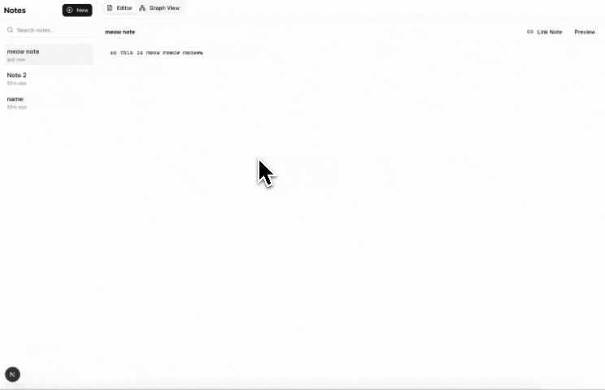

# Notes Graph

A simple and intuitive note-taking application with a visual graph interface for connecting related notes.



## Features

- Create and edit notes with markdown support
- Visual graph interface to connect related notes
- Real-time preview of note content
- Wiki-style linking between notes using `[[Note Title]]` syntax
- Interactive graph visualization with force-directed layout

## Getting Started

1. Clone the repository
2. Install dependencies:
   ```bash
   bun install
   ```
3. Run the development server:
   ```bash
   bun dev
   ```
4. Open [http://localhost:3000](http://localhost:3000) in your browser

## Project Structure

```
notes-graph/
├── app/                    # Next.js app directory
│   ├── page.tsx           # Main page component
│   └── layout.tsx         # Root layout
├── components/            # React components
│   ├── note-editor.tsx    # Note editing interface
│   ├── graph-view.tsx     # Interactive graph visualization
│   └── ui/               # Reusable UI components
├── lib/                   # Utility functions and types
│   ├── types.ts          # TypeScript type definitions
│   └── utils.ts          # Helper functions
└── public/               # Static assets
    └── notes-graph.gif   # Demo animation
```

## Component Architecture

### Note Editor (`components/note-editor.tsx`)
- Handles note creation and editing
- Implements markdown preview with syntax highlighting
- Manages wiki-style links between notes
- Uses `marked` for markdown parsing and `DOMPurify` for sanitization

### Graph View (`components/graph-view.tsx`)
- Renders an interactive force-directed graph
- Visualizes note connections
- Implements node dragging and zooming
- Uses HTML Canvas for performance

### Types (`lib/types.ts`)
- Defines core data structures:
  - `Note`: Represents a single note with title, content, and ID
  - `Connection`: Represents links between notes

## Tech Stack

- Next.js (App Router)
- TypeScript
- Tailwind CSS
- Bun (Runtime & Package Manager)
- Marked (Markdown parsing)


